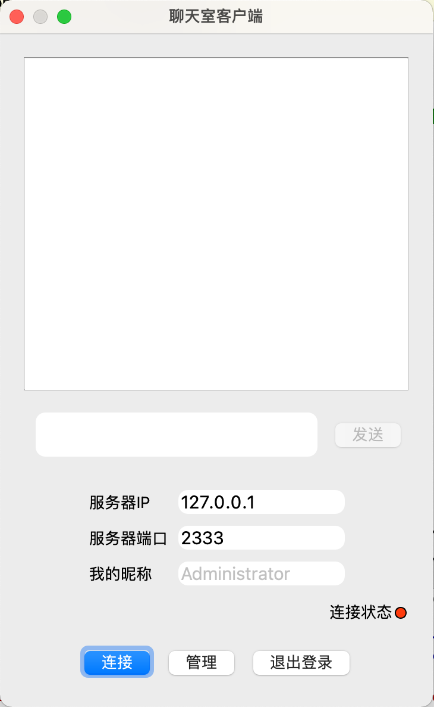

# QT_Chat
> QT网络编程练习项目，涉及QTcpSocket和QTcpServer知识，参考资料:http://www.4k8k.xyz/article/gongjianbo1992/107743780

### 说明

- 使用本地数据库SQlite存储用户信息，便于本地调试。当然也可以将数据库部署到公网。
- 分为Server服务端和Client客户端
  - 服务端仅负责开启服务和显示基础的房间、用户信息，不做任何信息的记录
  - 客户端分为管理员和普通用户，管理员有管理所有用户的权限，普通用户仅能更改自己的信息。
  - 初始生成两个账号，管理员 admin/123456，普通用户 test/123456
- 客户端可以多开，在本地测试时连接IP使用默认的127.0.0.1即可

---

### 内网穿透实现远程聊天

在本地测试哪有什么意思，实现和远在万里外的人实时通信才是关键。

> 便于测试，用户的数据库文件依旧是使用sqlite保存在本地

由于各大知名内网穿透工具提供的公网域名都是CNAME的，暂时支持的不是很好，因此想到利用公网服务器进行反向代理实现内网穿透，达到客户端可以直接连接我们的公网服务器IP。

我们使用`github`上一个知名的项目`frp`([链接点我](https://github.com/fatedier/frp))进行试验。

---

#### 测试环境

- Linux 公网服务器一台
- Windows 作为需要内网穿透的服务端

---

#### 实验过程

首先需要在Linux上和Win上分别下载对应的最新Release版本

```
tar -zxv frp_0.38.0_linux_amd64.tar.gz
cd frp_0.38.0_linux_amd64
```

在我们的公网服务器 Server A上配置 `frps.ini`设置通信端口

```
# frps.ini
[common]
bind_port = 7000
```

启动服务

```
./frps -c frps.ini
```

接着配置我们Windows端的 `frpc.ini` (这次我们实验使用默认的ssh类型即可)

```
# frpc.ini
[common]
server_addr = x.x.x.x
server_port = 7000

[ssh]
type = tcp
local_ip = 127.0.0.1
local_port = 22
remote_port = 7890
```

> server_addr 填入我们的公网IP
>
> server_port 刚刚的通信端口
>
> local_port 是需要进行映射的端口
>
> remote_port 是映射至公网服务器的端口

配置好后开启服务连接

```
.\frpc.exe -c frpc.ini
```

连接好后使用我们的客户端连接公网IP + 刚刚的`remote_port`即可。

---

### 运行效果


<<<<<<< HEAD


